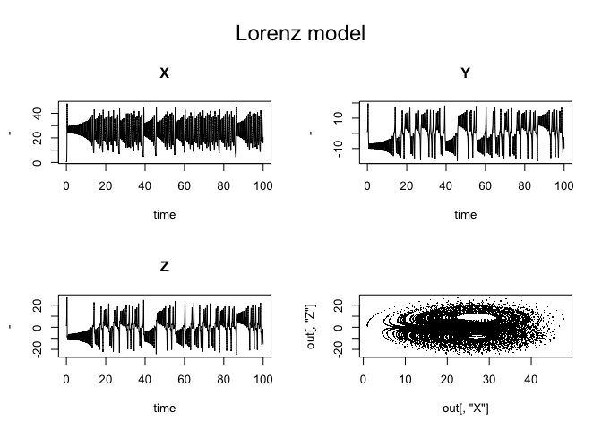

ODE Tutorial
================
Amy Benefield
1/28/2020

Libraries:

``` r
library("deSolve")
```

# 1\. A simple ODE: chaos in the atmosphere

We’re using the Lorenz equations as the first example. Following along
from tutorial
(<https://cran.r-project.org/web/packages/deSolve/vignettes/deSolve.pdf>).
The Lorenz equations are 3 DEs (X, Y, Z) representing earth’s
atmosphere. It’s an initial value problem (IVP). First, we must specify
the model, and then we implement it.

## 1.1 Model Specification:

Model Specification: define parameters, state variables and their
initial values, and writing model equation. \#\#\# Setting model
parameters, a, b, c:

``` r
parameters<-c(a=-8/3,
              b=-10,
              c=28)
```

### Setting state variables, X, Y, Z:

``` r
state<-c(X=1,
         Y=1,
         Z=1)
```

### Defining Model Equations:

Equations are specified in a function that we’ll name, Lorenz. Input to
function (in order) = model time (t),values of state variables (state),
and parameters. Parameter and state variables converted from vectors to
a list: with(as.list(c(state, parameters))

``` r
Lorenz<-function( t, state, parameters){
  with(as.list(c(state, parameters)),{
    # rate of change:
    dX <- a*X + Y*Z
    dY <- b * (Y-Z)
    dZ <- -X*Y + c*Y - Z
    
    # return the rate of change:
    list(c(dX, dY, dZ))
  }) # closing/ending the with(as.list(c(state, parameters)) code
}
```

## 1.2 Model Application:

## Time specification:

Run the model for 100 days, and give output at 0.01 daily intervals.

``` r
times<-seq(0, 100, by = 0.01)
```

### Model Integration:

Solve the model using the **ode** function from **deSolve** (uses
default integration). Function ode takes as input, a.o. the state
variable vector (y), the times at which output is required (times), the
model function that returns the rate of change (func) and the parameter
vector (parms). Function ode returns an object of class deSolve with a
matrix that contains the values of the state variables (columns) at the
requested output times.

``` r
out<-ode(y = state, times = times, func = Lorenz, parms = parameters)
head(out)
```

    ##      time         X        Y        Z
    ## [1,] 0.00 1.0000000 1.000000 1.000000
    ## [2,] 0.01 0.9848912 1.012567 1.259918
    ## [3,] 0.02 0.9731148 1.048823 1.523999
    ## [4,] 0.03 0.9651593 1.107207 1.798314
    ## [5,] 0.04 0.9617377 1.186866 2.088545
    ## [6,] 0.05 0.9638068 1.287555 2.400161

### Plotting Results:

Use plot method for class of deSolve objects. Outer upper margin
increased to allow for figure heading (mtext).

``` r
par(oma = c(0, 0, 3, 0))
plot(out, xlab = "time", ylab = "-") # Plotted vs. time
plot(out[, "X"], out[, "Z"], pch = ".") # Z vs. X
mtext(outer = TRUE, side = 3, "Lorenz model", cex = 1.5)
```

<!-- -->

# 2\. Solvers for initial value problems of ordinary differential equations

**deSolve** has several IVP ODE solvers. All integration methods can be
used by settting ode’s argument method, or can be run as stand alone
functions. for each integration routine, several options are available
to optimise performance. The next statements will use integration method
**radau** to solve the model, and set the tolerances to a higher value
than the default. Both statements are the
same:

``` r
outb <- radau(state, times, Lorenz, parameters, atol = 1e-4, rtol = 1e-4)
outc <- ode(state, times, Lorenz, parameters, method = "radau",
            atol = 1e-4, rtol = 1e-4)
```

The default integration method switches automatically between stiff and
non-stiff systems. This is a very robust method, but not necessarily the
most efficient solver. For most cases, the default solver, **ode** and
using the default settings will do. To show how to trigger the various
methods, we solve the model with several integration routines, each time
printing the time it took (in seconds) to find the solution:

``` r
print(system.time(out1 <- rk4 (state, times, Lorenz, parameters)))
```

    ##    user  system elapsed 
    ##   0.424   0.004   0.428

``` r
print(system.time(out2 <- lsode (state, times, Lorenz, parameters)))
```

    ##    user  system elapsed 
    ##   0.174   0.003   0.181

``` r
print(system.time(out <- lsoda (state, times, Lorenz, parameters)))
```

    ##    user  system elapsed 
    ##   0.217   0.000   0.221

``` r
print(system.time(out <- lsodes(state, times, Lorenz, parameters)))
```

    ##    user  system elapsed 
    ##   0.157   0.002   0.160

``` r
print(system.time(out <- daspk (state, times, Lorenz, parameters)))
```

    ##    user  system elapsed 
    ##   0.226   0.001   0.228

``` r
print(system.time(out <- vode (state, times, Lorenz, parameters)))
```

    ##    user  system elapsed 
    ##   0.153   0.000   0.153

## Runge-Kutta methods and Euler:

RK methods are de novo implementations. They comprise simple Runge-Kutta
formulae (Euler’s method euler, Heun’s method rk2, the classical 4th
order Runge-Kutta, rk4) and several Runge-Kutta pairs of order 3(2) to
order 8(7). ode23 and ode45 are aliases for the popular methods rk23bs
resp. rk45dp7. With the following statement all implemented methods are
shown:

``` r
rkMethod()
```

    ##  [1] "euler"   "rk2"     "rk4"     "rk23"    "rk23bs"  "rk34f"   "rk45f"  
    ##  [8] "rk45ck"  "rk45e"   "rk45dp6" "rk45dp7" "rk78dp"  "rk78f"   "irk3r"  
    ## [15] "irk5r"   "irk4hh"  "irk6kb"  "irk4l"   "irk6l"   "ode23"   "ode45"

The properties of a Runge-Kutta method can be displayed as follows:

``` r
rkMethod("rk23")
```

    ## $ID
    ## [1] "rk23"
    ## 
    ## $varstep
    ## [1] TRUE
    ## 
    ## $FSAL
    ## [1] FALSE
    ## 
    ## $A
    ##      [,1] [,2] [,3]
    ## [1,]  0.0    0    0
    ## [2,]  0.5    0    0
    ## [3,] -1.0    2    0
    ## 
    ## $b1
    ## [1] 0 1 0
    ## 
    ## $b2
    ## [1] 0.1666667 0.6666667 0.1666667
    ## 
    ## $c
    ## [1] 0.0 0.5 2.0
    ## 
    ## $stage
    ## [1] 3
    ## 
    ## $Qerr
    ## [1] 2
    ## 
    ## attr(,"class")
    ## [1] "list"     "rkMethod"

Here **varstep** informs whether the method uses a variable time-step;
**FSAL** whether the first same as last strategy is used, while
**stage** and **Qerr** give the number of function evaluations needed
for one step, and the order of the local truncation error. **A**,
**b1**, **b2**, **c** are the coefficients of the Butcher table. Two
formulae (rk45dp7, rk45ck) support dense output. It is also possible to
modify the parameters of a method (be very careful with this) or define
and use a new Runge-Kutta method:

``` r
func <- function(t, x, parms) {
  with(as.list(c(parms, x)),{
    dP <- a * P - b * C * P
    dC <- b * P * C - c * C
    res <- c(dP, dC)
    list(res)
    })
}

rKnew <- rkMethod(ID = "midpoint",
                  varstep = FALSE,
                  A = c(0, 1/2),
                  b1 = c(0, 1),
                  c = c(0, 1/2),
                  stage = 2,
                  Qerr = 1
                  )

out <- ode(y = c(P = 2, C = 1), times = 0:100, func,
           parms = c(a = 0.1, b = 0.1, c = 0.1), method = rKnew)
head(out)
```

    ##      time        P        C
    ## [1,]    0 2.000000 1.000000
    ## [2,]    1 1.990000 1.105000
    ## [3,]    2 1.958387 1.218598
    ## [4,]    3 1.904734 1.338250
    ## [5,]    4 1.830060 1.460298
    ## [6,]    5 1.736925 1.580136

### Fixed time-step methods:

There are two explicit methods that do not adapt the time step: the
euler method and the rk4 method. They are implemented in two ways:

  - as a **rkMethod** of the general rk solver. In this case the time
    step used can be specified independently from the times argument, by
    setting argument **hini**. Function **ode** uses this general code.
  - as special solver codes **euler** and **rk4**. These implementations
    are simplified and with less options to avoid overhead. The timestep
    used is determined by the time increment in the times argument.

For example, the next two statements both trigger the Euler method, the
first using the “special” code with a time step = 1, as imposed by the
**times** argument, the second using the generalized method with a time
step set by **hini**. Unsurprisingly, the first solution method
completely fails (the time step = 1 is much too large for this problem).

``` r
out <- euler(y = state, times = 0:40, func = Lorenz, parms = parameters)
outb <- ode(y = state, times = 0:40, func = Lorenz, parms = parameters,
            method = "euler", hini = 0.01)
```
